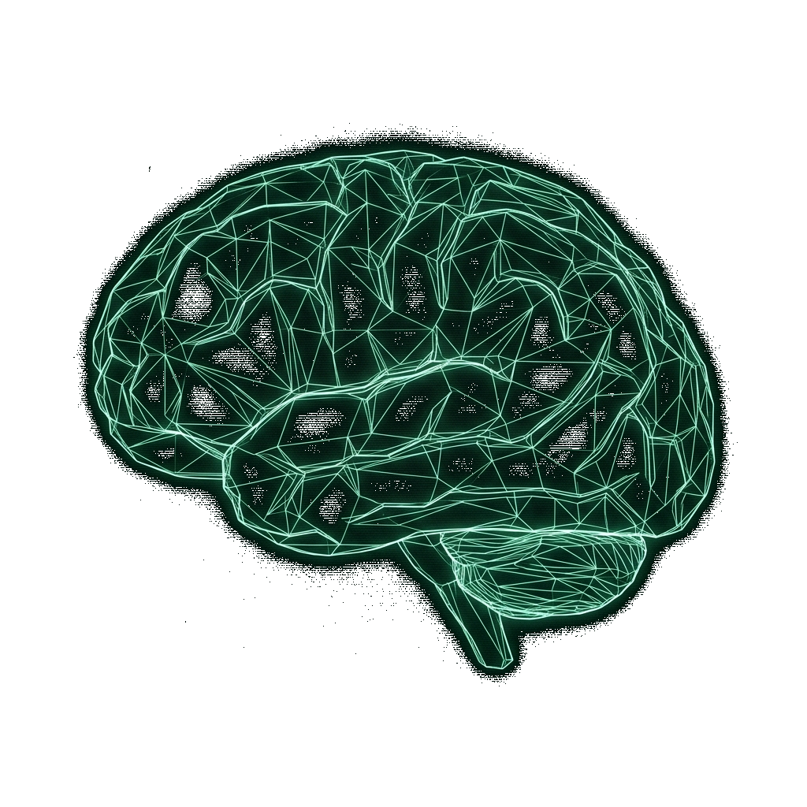

<div align="center">
  <picture>
    <source media="(prefers-color-scheme: light)" srcset="webapp/wireframe_brain_light.png">
    <source media="(prefers-color-scheme: dark)" srcset="webapp/wireframe_brain.png">
    
  </picture>
  <h1>brain2</h1>
  <p><b>Viwoods Second Brain Sync</b></p>
</div>

A completely serverless, automated pipeline that turns your Viwoods e-ink tablet into a smart, searchable Second Brain.

This tool automatically detects new handwritten Viwoods .note files in your Google Drive, uses Google's powerful **Gemini 2.5 Pro** model to flawlessly transcribe your handwriting into formatted Markdown, and syncs the text back to Google Drive. It even compiles "Master" Markdown files perfectly formatted for ingestion into **Google NotebookLM** or **Obsidian**.

## ✨ Features

- **Flawless Handwriting OCR:** Uses Gemini 2.5 Pro to transcribe messy handwriting with near-perfect accuracy.
- **Visual Syntax Recognition:** Draw specific shapes on your tablet to trigger Markdown formatting:
  - Draw an empty square `[ ]` to create a Markdown Checkbox (`- [ ]`).
  - Draw a vertical line `|` or bracket `[` in the margin to create a Markdown Blockquote (`>`).
  - Draw a horizontal line across the page to create a section break (`---`).
- **Folder Aware & Master Compiling:** Automatically categorizes your notes into `Scratch_Master.md` and `Work_Master.md` based on their subdirectories, allowing you to easily separate contexts in NotebookLM.
- **Smart Syncing:** Compares timestamps. It only processes Viwoods .note files that are new or have been recently modified, aggressively saving API quota.
- **Serverless:** Runs entirely on Google Cloud Functions for free.

## 🏗 Architecture

1. **E-Ink Tablet:** Syncs raw handwritten `.note` files to a specific Google Drive folder (e.g., `Viwoods-Note`).
2. **Google Cloud Scheduler:** Wakes up the Cloud Run Function on a daily or hourly schedule.
3. **Cloud Run Function:** Scans the Drive folder and downloads new/modified Viwoods .note files.
4. **Gemini API:** Reads the Viwoods .note files and converts the handwriting to structured Markdown (`.md`).
5. **Google Drive:** The Cloud Function uploads the individual `.md` files back to their original subfolders and updates the combined Master files in the root folder.
6. **NotebookLM / Obsidian:** Connects directly to the Master Markdown files for your final Knowledge Graph and AI search.

## 🚀 Setup Guide

### Step 1: Google Cloud & Drive Setup
1. Create a [Google Cloud Project](https://console.cloud.google.com/).
2. Enable the **Google Drive API** in your project.
3. Generate an OAuth Client ID (Desktop App) to authenticate your personal Google Drive account. You will need to export the resulting `token.json` file. (This bypasses strict storage quota limits placed on standard Service Accounts).

### Step 2: Gemini API Key
1. Go to [Google AI Studio](https://aistudio.google.com/) and generate a free API Key.
2. *(Note: The free tier currently allows 20 requests per day for Gemini 2.5. If you process more than 20 notebooks a day, enable "Pay-As-You-Go" billing on your Google Cloud project).*

### Step 3: Deploying to Cloud Run
1. Fork this repository to your own GitHub account.
2. In Google Cloud, navigate to **Cloud Run** and click **Deploy Container > Continuously deploy from a repository**.
3. Point it to your forked repository.
4. Set the Build Configuration:
   - **Build type:** Buildpacks
   - **Context directory:** `/cloud_function`
5. Under **Variables & Secrets**, add the following Environment Variables:
   - `GEMINI_API_KEY`: Your key from Step 2.
   - `DRIVE_TOKEN_JSON`: Paste the entire raw JSON string from your `token.json` file (from Step 1).
   - `DRIVE_FOLDERS` (Optional): A comma-separated list of folder names to scan. Defaults to `Viwoods-Note`.
6. Click **Deploy**.

### Step 4: Cloud Scheduler
1. Go to **Cloud Scheduler** in Google Cloud.
2. Create a new job targeting the HTTP URL of your newly deployed Cloud Run service.
3. Set the frequency using Cron syntax (e.g., `0 2 * * *` to run at 2 AM every night).

## 🛠 Useful Commands

Tail the live logs for the Cloud Run function to debug any issues:
```bash
gcloud beta run services logs tail secondbrain-gdrive --region us-central1 --project YOUR_PROJECT_ID
```

## 🌐 Web Application

This repository includes a front-end **Web Application** (`/webapp`) hosted on GitHub Pages that provides a beautiful, native-like interface to view and read your processed Markdown files directly from your browser.

### Features
- **Direct Google Drive Integration:** Connects securely to your Google Drive to load the transcribed `.md` files dynamically.
- **Auto-Sync:** Silently polls Google Drive every 60 seconds in the background to hot-swap content without disrupting your reading or closing expanded folders.
- **Persistent Sessions:** Your Google Drive token is securely cached in your browser's local storage so you don't have to log in on every page refresh.
- **Image Support:** Seamlessly loads embedded drawings and blank pages exported by the sync script, fully supporting dark/light mode via transparency rendering.
- **Tree Navigation:** Explore your Viwoods folder hierarchy easily via a collapsible file tree.
- **GitHub Pages Deployment:** Automatically deployed and hosted via the included `.github/workflows/webapp.yaml` configuration.

To use the web app, simply visit the hosted version here:
**👉 [https://secretsciencelab.github.io/viwoods-brain2/](https://secretsciencelab.github.io/viwoods-brain2/)**

Because the app is fully client-side and only connects directly to Google Drive via your browser, anyone can safely use this hosted URL by just plugging in their own Google Drive Client ID! You do not need to host your own copy.